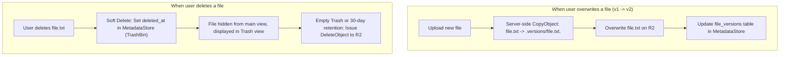
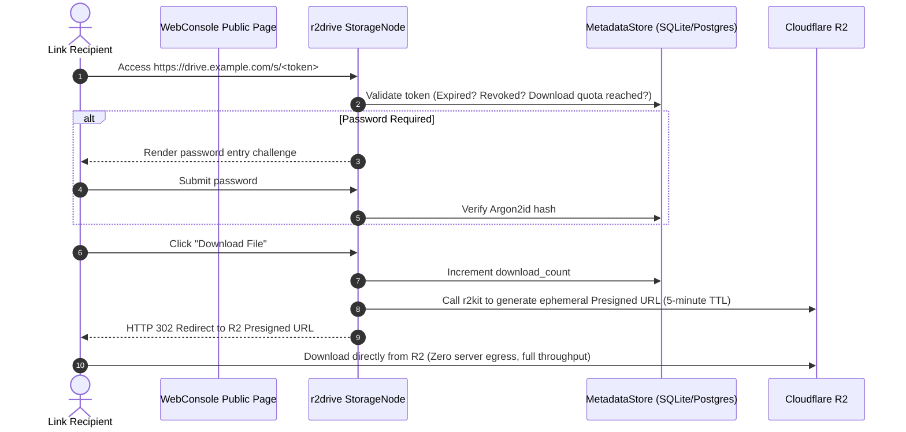

# Research: Trash Bin, File Versioning, and Secure Sharing Architecture for r2drive

**Date**: 2026-09-12  
**Target**: `r2drive` Architecture (Phases 2, 3, and 4)  
**Primary Sources Checked**:
- Cloudflare R2 S3 API Compatibility Reference (`https://developers.cloudflare.com/r2/api/s3/api/`)
- `r2kit` Scope & Capabilities (`file:///Users/trungdt/Workspace/lib/r2kit/README.md`)

---

## 1. Cloudflare R2 Limitation: Native Object Versioning

### Findings
According to the official Cloudflare R2 S3 API Compatibility table:
- `GetBucketVersioning`: **❌ Unsupported**
- `PutBucketVersioning`: **❌ Unsupported**
- `x-amz-version-id` in DeleteObject: **❌ Unsupported**

Cloudflare R2 **does not** provide native AWS S3-style bucket object versioning or delete markers. `r2kit` explicitly excludes versioning and lifecycle policies from its core scope as well.

### Architectural Solution: Application-Level Versioning & Soft-Delete
To deliver a true "Drive" experience without native R2 bucket versioning, `r2drive` implements **Application-Level Versioning and Soft-Delete**:

1. **Trash Bin (Soft Delete)**:
   - Deleted objects are **not immediately purged from R2**.
   - `MetadataStore` sets a `deleted_at: DateTime` timestamp. The file immediately disappears from standard views and appears exclusively in the "Trash" interface.
   - Users can invoke **Restore** (resetting `deleted_at = NULL`) instantly without data transfer or egress costs.
   - When users trigger **Empty Trash** or when a background retention worker runs (e.g. 30-day retention policy), `StorageNode` issues permanent `DeleteObject` calls to R2.

2. **File Versioning (Historical Snapshots)**:
   - Before uploading an overwrite to an existing object, `StorageNode` executes a server-side `CopyObject` (executed within R2, zero egress, near-instantaneous) targeting the prefix `.versions/<original_key>.<version_id>`.
   - The `file_versions` table in `MetadataStore` tracks: `(file_id, version_id, size, modified_at, version_key)`.
   - WebConsole provides an inspector allowing users to preview older versions or execute one-click rollbacks.

---

## 2. Secure Public Link Sharing Architecture

### The Problem with Bare Presigned URLs
- Bare presigned S3 URLs cannot be revoked prior to their embedded expiration timestamp.
- Bare presigned S3 URLs cannot enforce passwords, download count limits, or view-only access.

### The Solution: Capability URL + Short-Lived Presigned Redirect Gateway
`r2drive` adopts a **Gatekeeper Gateway Pattern**:

### Key Advantages:
1. **Instant Revocation**: The owner clicks "Revoke Share" in WebConsole $\rightarrow$ `StorageNode` marks `is_revoked = true` in DB. Any subsequent request is rejected immediately.
2. **Password Protection**: Passwords are securely hashed with Argon2id and verified by `StorageNode`.
3. **Download Limit Quota**: Configurable download caps (e.g., "Maximum 3 downloads") $\rightarrow$ automatically closes the link once reached.
4. **Zero Server Egress**: The recipient streams the payload directly from Cloudflare R2 via a 5-minute ephemeral URL, bypassing server bandwidth bottlenecks.

---

## 3. Smart Selective Sync & Virtual Files (Phase 4)

### Evolution Path
- **Stage 1 (CLI Sync)**: `r2drive sync <local> <remote>` with **Conflict Branching** (generates `(Conflicted Copy YYYY-MM-DD)` files upon divergence, avoiding data loss).
- **Stage 2 (Local WebDAV)**: `StorageNode` serves a local WebDAV endpoint. Users mount it in macOS Finder or Windows Explorer $\rightarrow$ directory trees render natively as a network drive, streaming file bytes on-demand.
- **Stage 3 (On-Demand Hydration)**: Uses local 0-byte placeholder stubs combined with an LRU disk cache to automatically evict cached files when local disk space is constrained.
